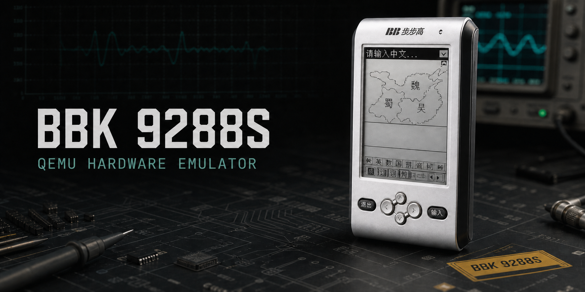

# BBK 9288S QEMU

> 项目同时支持横屏、53 键的 BBK 9288 机型；9288 是本仓库的主机型，
> 参见 [README.md](README.md)。

基于 QEMU 11.0 的步步高 9288S 硬件模拟器。项目实现了 Epson
S1C33L05 CPU、9288S 板级外设、16 灰阶 LCD、触摸/按键、持久化 NAND，
以及外部 MP3 硬解码器总线。

这是非官方逆向工程项目，与步步高、Epson 或 QEMU 项目没有隶属关系。

## 当前状态

- 板级加载器可从 NAND FAT16 中读取真实 `kernel.bin` 并完成启动。
- `160 x 240` LCDC 根据 MODE0 寄存器解析 1/2/4/8 bpp 和灰阶 LUT；
  stock 固件默认使用 2 bpp 四灰阶，切换到 4 bpp 时可显示 16 灰阶。
  P2.3 背光开关和自动熄屏会同步反映到模拟器画面。
- 触摸通过 FPT6、Timer3-B 和板级串行 ADC 硬件路径进入固件。
- 方向键通过 K5 GPIO，确定/退出通过 P0 GPIO 进入固件。
- Timer2-B 提供 GUI 和游戏需要的系统节拍。
- 外部音频模型支持 VS1003 SCI 控制/状态、DREQ 背压和 MP3 码流输出；
  固件播放器可显示总时长与递增的当前播放时间。
- Samsung 兼容 `EC DA 10 95` NAND 支持读取、编程、擦除、运行中增量同步
  和退出时最终刷新。

触摸、按键和音频只经过 QEMU 的 FPT、GPIO、串行 ADC、定时器与板级音频
数据口模型；源码不包含 guest 内存注入、系统 API 注入或应用级 hook。
其余诊断属性只用于逆向研究，默认全部关闭。

## 快速开始

当前 Release 面向 Windows x64。

1. 从 [Releases](https://github.com/HelloClyde/bbk9288s-qemu/releases) 下载
   `bbk9288s-qemu-*-windows-x64.zip`。
2. 下载同一 Release 中的 `bbk9288s-test-nand.zip`，解压到模拟器目录。
3. 双击 `run-bbk9288s.cmd`，或在 PowerShell 中运行：

   ```powershell
   .\run-bbk9288s.ps1
   ```

启动时，板级加载器扫描 NAND OOB 中的 FTL 映射，挂接 FAT16，并在目录树
中寻找 `kernel.bin`；不再需要 NAND 之外的内核文件。测试 NAND 作为独立
Release 资产发布，不进入 Git 源码历史。请只使用你有权使用和分发的固件
与系统文件。

## 操作

| 9288S 输入 | 本机窗口 |
| --- | --- |
| 上 / 下 / 左 / 右 | 方向键 |
| 确定 | `Enter` / `Space` |
| 退出 | `Esc` / `Backspace` |
| 触摸屏 | 鼠标 |

固件任务栏最右侧的背光图标可以关闭或重新打开背光；系统设置中的背光
超时使用同一条 P2.3 硬件控制路径。

首次启动会要求依次点击 `(16,24)`、`(144,216)`、`(80,120)` 三个校准点。

## 运行目录

源码构建默认使用源码树旁边的 `eebbk9288s-runtime`：

```text
E:\
├─ eebbk9288s-qemu\
└─ eebbk9288s-runtime\
   └─ nand-user.raw
```

Release 解压版默认使用包内的 `runtime`。可以通过参数或环境变量改写：

```powershell
.\run-bbk9288s.ps1 -RuntimeDir D:\9288s-data
$env:BBK9288S_RUNTIME_DIR = 'D:\9288s-data'
```

这样重新配置或清理 QEMU 构建目录不会删除 NAND 和固件。

## 源码构建

依赖：

- Windows 10/11 x64
- MSYS2 UCRT64

在 MSYS2 UCRT64 中安装基本构建依赖：

```bash
pacman -S --needed base-devel git diffutils \
  mingw-w64-ucrt-x86_64-toolchain \
  mingw-w64-ucrt-x86_64-glib2 \
  mingw-w64-ucrt-x86_64-pixman \
  mingw-w64-ucrt-x86_64-zlib \
  mingw-w64-ucrt-x86_64-ninja \
  mingw-w64-ucrt-x86_64-python
```

从 PowerShell 配置和构建：

```powershell
New-Item -ItemType Directory -Force _build | Out-Null
$env:CHERE_INVOKING = '1'
$env:MSYSTEM = 'UCRT64'
Push-Location _build
& C:\msys64\usr\bin\bash.exe -lc '../configure --target-list=s1c33-softmmu --without-default-features --enable-tcg --enable-vnc --enable-pixman --disable-werror --disable-docs --disable-tools'
& C:\msys64\usr\bin\bash.exe -lc 'ninja qemu-system-s1c33.exe'
Pop-Location
```

之后运行 `run-bbk9288s.ps1`。启动器会优先查找根目录 Release
二进制，其次查找 `build` 和 `_build`。

## 发布

`.github/workflows/release.yml` 在推送 `v*` tag 时：

1. 在 MSYS2 UCRT64 中构建 QEMU Windows x64 二进制。
2. 递归收集所需 MSYS2 DLL。
3. 生成 ZIP、文件清单和 SHA-256。
4. 创建 GitHub Release。
5. 如果 `nand-test-image` Release 已存在，则附带测试 NAND 资产。

首次或更新测试 NAND 时，在仓库根目录运行：

```powershell
.\scripts\publish-bbk9288s-nand.ps1 `
  -NandPath .\runtime\nand-user.raw `
  -Repository HelloClyde/bbk9288s-qemu
```

该脚本会验证 NAND 大小、压缩镜像、生成 SHA-256，并上传到
`nand-test-image` prerelease。NAND 不会被提交到 Git。

## 实现位置

- `target/s1c33/`：S1C33 CPU 状态、TCG 翻译、异常、中断和反汇编。
- `hw/s1c33/bbk9288s.c`：9288/9288S 内存映射和板级硬件模型。
- `scripts/bbk9288s_nand_image.py`：NAND FTL/OOB 提取、打包和系统安装。
- `plan.md`：逆向过程、验证证据和后续工作。
- `docs/technical-notes.md`：详细寄存器、调试属性和实验记录。

## 安全

安全问题请参考 [SECURITY.md](SECURITY.md)。

## 许可

本仓库是 QEMU 的修改版本，遵循上游相应的 GPL-2.0 和 LGPL-2.1
许可，详见 [LICENSE](LICENSE)、[COPYING](COPYING) 和
[COPYING.LIB](COPYING.LIB)。

`kernel.bin`、NAND 镜像和 NAND 内文件不因本仓库源码许可而自动获得
重新分发授权。发布者和使用者需要自行确认相关权利。

硬件研究参考：

- [Epson S1C33L05 Technical Manual](https://global.epson.com/products_and_drivers/semicon/pdf/id000276.pdf)
- [QEMU](https://www.qemu.org/)
