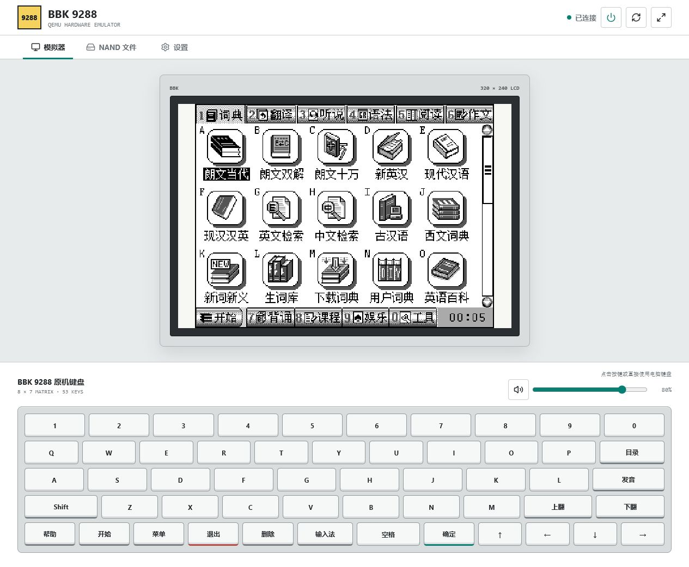
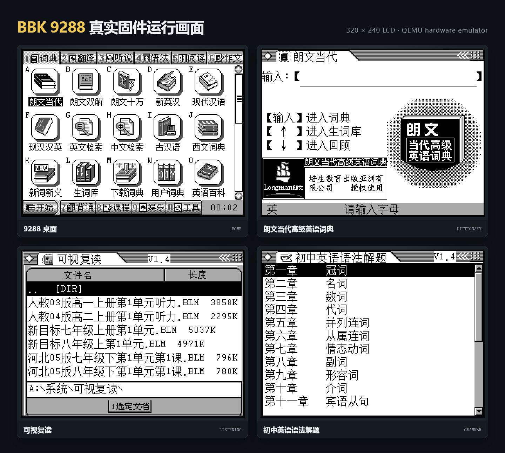

# 步步高 BBK 9288 QEMU 模拟器

这是基于 QEMU 11.0 实现的 BBK 9288 硬件模拟器，模拟 Epson S1C33L05
处理器、`320 × 240` 横屏、53 键矩阵、NAND、音频及相关板级硬件。

源码仓库不包含步步高原厂固件、系统文件或 NAND 镜像。运行前请自行准备
有权使用的 9288 V1.5 NAND；Windows 便携发布包也应将这些文件作为独立资产
提供，不写入 Git 历史。

## 效果预览

启动后的 Web 控制台（9288 专用界面、320 × 240 LCD 和完整 53 键面板）：



真实 V1.5 固件中的桌面、朗文当代、可视复读和初中英语语法：



## 已实现

- QEMU machine type：`bbk9288`；启动脚本和 Web 控制台只面向 9288。
- 320 × 240 LCDC、40 KiB IVRAM 及 1/2/4/8 bpp 调色板渲染。
- 9288 启动扩展窗口 `0x003A0000`，包括固件实测的初始化命令和就绪握手。
- S1C33L05 标准串行接口状态，启动所需的 TDBE 行为。
- Samsung 兼容 256 MiB NAND、2 KiB 页、64 字节 OOB、FTL 和 FAT16。
- NAND 按脏块增量回写，每 250 ms 同步一次；即使模拟器被强制结束，已经完成
  的页编程和块擦除也不会等到正常退出才落盘。
- 从 NAND 中递归定位并加载 `kernel.bin`。
- V1.5 完整文件树：根目录 `kernel.bin`、`mp3`、`系统`，共 260 个文件、
  156,310,685 字节。
- 8 行 × 7 列原机键盘矩阵：`0x00300F46` 行选通、K5/P0 七路列输入、
  K6.4 唤醒和 Timer3 去抖中断。
- 按 V1.5 内核 `0x021994DC` 的矩阵转换表映射数字、字母、翻页、删除、
  确定、功能键和四方向键。
- 16 位 Timer0/1 比较中断、四路 8 位定时器及 HSDMA 单次/连续/块传输。
- S1C33 的 `INT`、`RETD`、`BRK`、`MIRROR` 和 `MAC` 指令。
- VS1003 压缩音频数据通路；Windows 包通过 `ffplay.exe` 直接播放原固件
  从 NAND 读取并送往解码器的声音。
- Web 控制台：noVNC 320 × 240 显示、完整 53 键面板、浏览器音频、
  电源控制和 NAND 文件管理。
- Windows SDL 桌面窗口、可点击的 53 键软键盘及一键启动脚本。

当前固件可进入 V1.5 词典桌面，显示词典、翻译、语法、阅读、作文等应用
图标。已实测软键盘“确定”可关闭系统提示，方向键可移动日历选中框。
NAND 是可写的，并在运行过程中增量保存。

## 快速开始

从 [Releases](https://github.com/HelloClyde/bbk9288-emulator/releases) 下载并
解压 Windows x64 发布包。发布包已包含 Python 运行时、Python 依赖、Web
静态资源和 QEMU 运行库，不需要另外安装 Python、npm 或 `ffplay`。

将有权使用的 9288 NAND 镜像放到 `runtime\nand-user.raw`，双击
`run-bbk9288-web.cmd` 即可启动。也可以在 PowerShell 中运行：

```powershell
.\run-bbk9288-web.ps1
```

从源码运行时，需要先构建 `qemu-system-s1c33.exe` 并安装 Web 依赖：

```powershell
python -m pip install -r .\requirements-bbk9288.txt
Push-Location .\web
npm ci
Pop-Location
.\run-bbk9288-web.ps1 -Nand .\runtime\nand-user.raw
```

浏览器访问 `http://127.0.0.1:8000/`；启动器还会输出可供同一局域网手机或
电脑访问的地址。网页中的扬声器按钮用于开启声音，按 `Ctrl+C` 可停止模拟器。

## Web 前端功能

- 320 × 240 横屏 noVNC 显示，支持像素级缩放和全屏。
- 与原机布局一致的 53 键面板；电脑键盘也可直接输入。
- 固件 VS1003 压缩音频流的浏览器播放和音量控制。
- 模拟器启动、重启、连接状态和 USB 供电状态。
- NAND 维护模式、目录浏览、上传、下载、重命名和删除。

端口可按需调整：

```powershell
.\run-bbk9288-web.ps1 `
  -Nand .\runtime\nand-user.raw `
  -HttpPort 8080 `
  -WebSocketPort 6082 `
  -QmpPort 6083
```

WebSocket 和 HTTP 文件管理接口默认没有认证或传输加密，只应在可信局域网
使用。QMP 始终只监听本机。

Web 前端固定使用 BBK 9288 机型，不提供机型切换逻辑。

## 构建

在 MSYS2 UCRT64 环境中：

```bash
mkdir -p _build
cd _build
../configure \
  --target-list=s1c33-softmmu \
  --without-default-features \
  --enable-tcg \
  --enable-vnc \
  --enable-pixman \
  --enable-sdl \
  --disable-sdl-image \
  --disable-werror \
  --disable-docs \
  --disable-tools
ninja qemu-system-s1c33.exe
```

确认机型：

```powershell
.\_build\qemu-system-s1c33.exe -machine help
```

输出中应包含 `bbk9288`。

## 生成 9288 NAND

仓库内的 NAND 工具支持 FTL/FAT16 提取、安装和重新打包，可以把系统文件树
安装到 FAT 根目录，并重新生成固件兼容的 GBK 短文件名。详细命令和镜像结构
参见 [技术笔记](docs/technical-notes.md)。

## 启动探针

开发时可用短时探针查看 CPU、MMIO 和 LCD：

```powershell
python .\scripts\bbk9288_probe.py `
  --nand .\runtime\nand-user.raw `
  --seconds 8
```

输出帧位于 `_build\bbk9288-probe\probe.pgm`。

## 回归测试

下面的测试会校验 CPU 新指令、V1.5 启动、LCD、键盘硬件路径、NAND 强制退出
恢复及二次启动；测试使用 NAND 副本，不修改传入的原镜像：

```powershell
.\scripts\test-bbk9288.ps1 `
  -Nand .\runtime\nand-user.raw `
  -AudioPlayer <ffplay.exe路径>
```

## CI 与发布

提交到 `main`、创建拉取请求或手动运行工作流时，GitHub Actions 会构建并
冒烟测试 Windows x64 Web 发布包，构建产物可在对应的 Actions 运行页面下载。

推送以 `v` 开头的 tag 会在构建通过后自动创建 GitHub Release：

```powershell
git tag v0.1.0
git push origin v0.1.0
```

Release 包含 ZIP 和 SHA-256 校验文件；ZIP 内置 Python 运行时及全部 Web
运行依赖，但不包含原厂固件、系统文件或 NAND 镜像。工作流会检查发布包，
发现这些文件或测试私钥时立即失败。

## 代码结构

- `hw/s1c33/`：9288 板级设备、LCD、NAND、音频、定时器、DMA 和输入模型。
- `target/s1c33/`：Epson S1C33 CPU 翻译、指令 helper 和反汇编。
- `scripts/`：NAND FTL/FAT16 工具、启动探针和端到端回归测试。
- `scripts/bbk9288-softkeyboard.ps1`：Windows 53 键软键盘。
- `scripts/bbk9288_probe.py`、`scripts/test-bbk9288.py`：短时探针和端到端
  回归测试。
- `web/`、`scripts/bbk9288_web_server.py`：9288 Web 控制台、QEMU
  生命周期、浏览器音频和 NAND 管理 API。

## 资料依据

- 9288 原机 V1.2 使用说明书：规格页给出 320 × 240、53 键、256M Flash，
  外观页确认横屏键盘机且没有触摸层。
- [Epson S1C33L05 Technical Manual](https://www.epson.jp/prod/semicon/pdf/id000446.pdf)：
  CPU、40 KiB IVRAM、LCDC、NAND、串行接口及寄存器定义。
## 当前限制

- USB 和少量未被 9288 V1.5 固件当前路径使用的板级扩展寄存器仍是实验性模型。
- 音频已接通宿主播放，但仍由 `ffplay` 负责 MPEG 解码，不模拟 VS1003 内部
  的音质、模拟输出和所有 SCI 扩展行为。
- 53 键矩阵按 V1.5 内核表实现；个别功能键在不同应用中的用途由固件上下文
  决定，键帽文字采用 V1.2 使用说明书中的通用名称。
- 此项目是非官方逆向工程，与步步高、Epson 或 QEMU 项目没有隶属关系。

## 许可证

模拟器源码沿用 QEMU 的许可证体系；整体按仓库根目录 `LICENSE`、`COPYING`
和各源文件中的许可证声明发布。请勿在 Issue、PR 或提交中上传无权再分发的
原厂固件、NAND 镜像、说明书或安装包。
